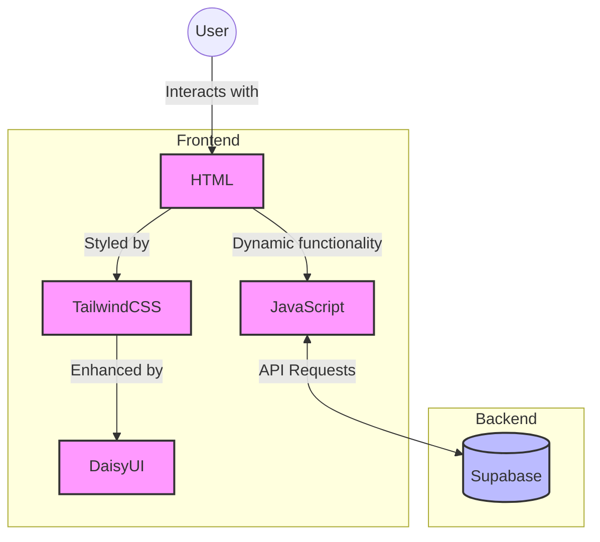

# Blog Builder Project

This project is a comprehensive walkthrough for building a blog using modern web technologies. The frontend is constructed with HTML, styled using TailwindCSS and DaisyUI, and enhanced with JavaScript for interactivity. The backend is powered by Supabase, providing a robust and scalable infrastructure for data management.

## Project Overview

- Frontend: HTML, TailwindCSS, DaisyUI, JavaScript
- Backend: Supabase
- Purpose: Create a fully functional blog with a sleek, responsive design

### Features

- [x] All readers to see all posts
- [x] All users to add a new post - (TODO v1)
- [x] All users to delete a post
    - [x] When hits "delete" button from each post (frontend)
    - [x] remove the post from supabase (backend)
    -  [x] **Minimum Viable Solution**, MVS (i.e.: the simplest "correct" thing that solves the problem)  
        - [x] Iterate on our MVS, and make it work for real - TODO (v2)
    - [x] refresh the page (frontend)
    - [x] Create the Data Model for my Blog app - TODO (v3), before working on this, you should have completed: https://docs.ulem.org/doc/building-a-full-stack-blog-with-javascript-and-supabase-implementing-post-deletion-R0e7GiW7TS_
      - [x] Create a draft of the data model (with Ai-assistance) 
      - [x] Create the respective in Supabase (be sure the tables in lowercase and the columns are snake_cased)
      - [x]  Generate and populate your tables with your generated mock data
      - [x] Test and share your API (with the public link on slack)
  
I'm building a blog the backend is powered by Supabase using PostgreSQL

your task is to design my data model, draw it in mermaid

